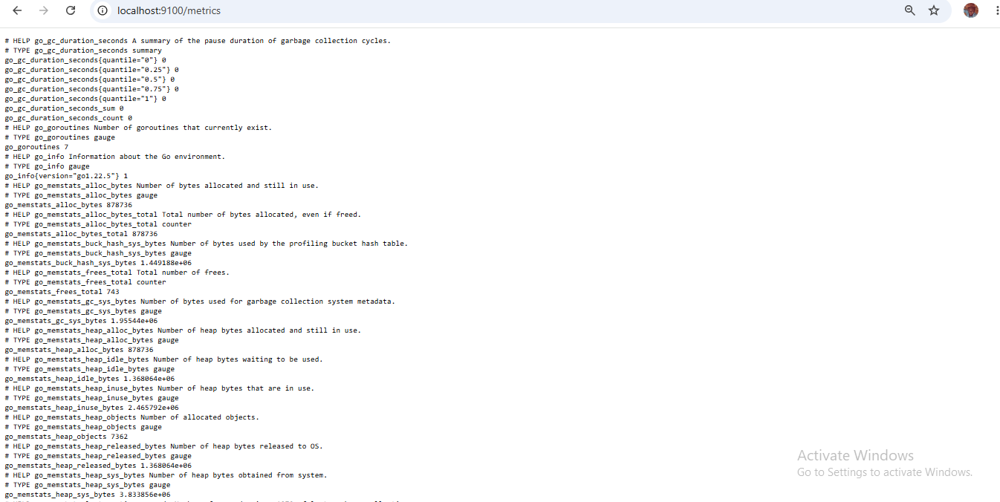
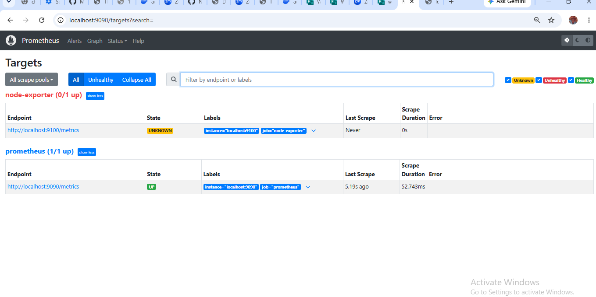
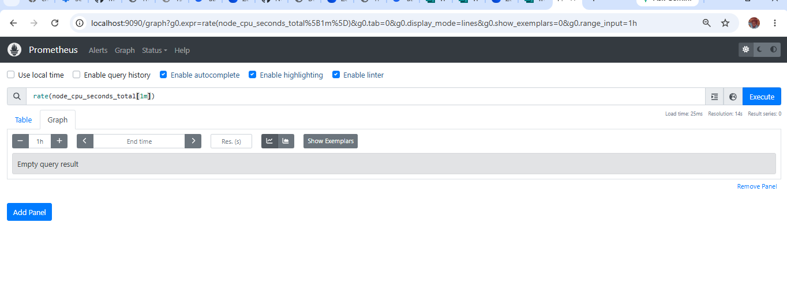

# Prometheus Monitoring Assignment

## Objective

Build a small Prometheus monitoring setup that demonstrates understanding of:


• `prometheus.yml`.
• Prometheus targets.
• Node Exporter.
• Scrape configuration.
• PromQL queries.

The task: configure Prometheus to monitor the local machine using Node Exporter.

-----

## 1. What is prometheus.yml?

`prometheus.yml` is the main configuration file for Prometheus. It tells Prometheus **what** to monitor, **how often** to check it, and **where** to find it. Without this file, Prometheus wouldn’t know which servers or services to collect metrics from. Think of it as the instruction sheet Prometheus reads on startup to know its job.

## 2. Configuration Explanation

```yaml
global:
  scrape_interval: 15s

scrape_configs:

◦ job_name: "prometheus".
    static_configs:

• targets: ["localhost:9090"].


◦ job_name: "node-exporter".
    static_configs:

• targets: ["localhost:9100"].
```


• **global** — the section that holds settings that apply to the whole Prometheus instance unless a specific job overrides them..
• **scrape_interval** — how often Prometheus pulls (scrapes) metrics from its targets. Here it’s set to 15 seconds, meaning Prometheus checks each target every 15 seconds..
• **scrape_configs** — the list of all the things Prometheus is configured to monitor. Each entry in this list is one monitoring “job.”.
• **job_name** — a label/nickname given to a group of targets, used to identify where a set of metrics came from (e.g. “node-exporter”)..
• **static_configs** — a fixed, manually-defined list of targets (as opposed to targets discovered automatically/dynamically)..
• **targets** — the actual `host:port` addresses Prometheus connects to in order to collect metrics. `localhost:9090` is Prometheus monitoring itself, and `localhost:9100` is where Node Exporter exposes its metrics..

## 3. Exporter Explanation

**Node Exporter** is a lightweight program that runs on a machine and collects operating-system and hardware-level metrics — things like CPU usage, memory usage, disk space, and network stats. It exposes these metrics as plain text on `http://localhost:9100/metrics`.

Prometheus itself doesn’t know how to read a machine’s hardware stats directly — it only knows how to scrape metrics from an HTTP endpoint. Node Exporter is what “translates” the machine’s raw system data into a format Prometheus can scrape and store. That’s why it’s used in this assignment: it lets us monitor the local machine’s health through Prometheus.

## 4. Setup & Run Instructions

### Step 1 — Download and run Node Exporter

```bash
wget https://github.com/prometheus/node_exporter/releases/download/v1.8.2/node_exporter-1.8.2.linux-amd64.tar.gz
tar xvf node_exporter-1.8.2.linux-amd64.tar.gz
cd node_exporter-1.8.2.linux-amd64
./node_exporter
```

This starts Node Exporter on port `9100` and exposes metrics at `http://localhost:9100/metrics`. Leave this process running.

### Step 2 — Verify Node Exporter is exposing metrics

Visit `http://localhost:9100/metrics` in a browser (or `curl localhost:9100/metrics`). A long list of metric lines (e.g. `node_cpu_seconds_total`) confirms it’s working. This is the evidence captured in `screenshots/node-exporter.png`.

### Step 3 — Download Prometheus and add the config

```bash
wget https://github.com/prometheus/prometheus/releases/download/v2.54.1/prometheus-2.54.1.linux-amd64.tar.gz
tar xvf prometheus-2.54.1.linux-amd64.tar.gz
cd prometheus-2.54.1.linux-amd64
```

Place the `prometheus.yml` from this repo into this folder (or edit the default one to match).

### Step 4 — Start Prometheus

```bash
./prometheus --config.file=prometheus.yml
```

Prometheus starts its web UI on port `9090`.

### Step 5 — Verify both targets are being monitored

Visit `http://localhost:9090/targets`. Both jobs should appear with state **UP**:


• `prometheus`.
• `node-exporter`.

This is the evidence captured in `screenshots/targets.png`.

### Step 6 — Run PromQL queries

Visit `http://localhost:9090/graph`, enter each query below, and execute it. See section 5 for the queries, results, and explanations. At least one successful query is captured in `screenshots/promql.png`.

## 5. PromQL Queries

Students must run at least 5 PromQL queries covering: whether the Node Exporter target is up, CPU-related info, memory-related info, disk/filesystem-related info, and a query that filters using a label.

|#|Query                                        |What It Checks                                                              |Result / Explanation                                                                                                                                               |
|-|---------------------------------------------|----------------------------------------------------------------------------|-------------------------------------------------------------------------------------------------------------------------------------------------------------------|
|1|`up{job="node-exporter"}`                    |Whether the Node Exporter target is reachable                               |Returned `1`, confirming Prometheus successfully connected to Node Exporter and it is up.                                                                          |
|2|`rate(node_cpu_seconds_total[1m])`           |CPU-related information — usage rate over the last minute                   |Shows how much time each CPU core spent in each state (idle, user, system) per second over the last minute — a higher “user”/“system” rate means the CPU is busier.|
|3|`node_memory_MemAvailable_bytes`             |Memory-related information — available system memory                        |Returned the number of bytes of RAM currently free and available for use on the machine.                                                                           |
|4|`node_filesystem_avail_bytes{mountpoint="/"}`|Disk/filesystem-related information — available space on the root filesystem |empty query                                                                                   |
|5|`up{job="node-exporter"}`                    |A query that filters using a label (`job`)                                  |Demonstrates label filtering — only returns the `up` status for the `node-exporter` job, excluding the `prometheus` job’s own status.                              |

## 6. Screenshots

**Node Exporter metrics endpoint** (`localhost:9100/metrics`):


**Prometheus Targets page** (both jobs showing UP):


**Successful PromQL query**:


## 7. Repository Structure

```
prometheus-monitoring-assignment/
├── prometheus.yml
├── README.md
└── screenshots/
    ├── node-exporter.png
    ├── targets.png
    └── promql.png
```
